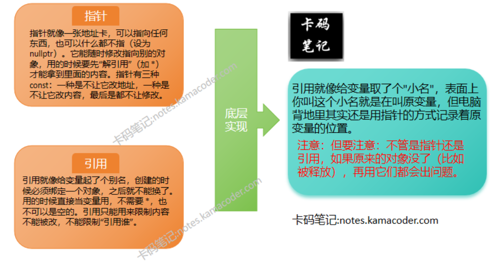
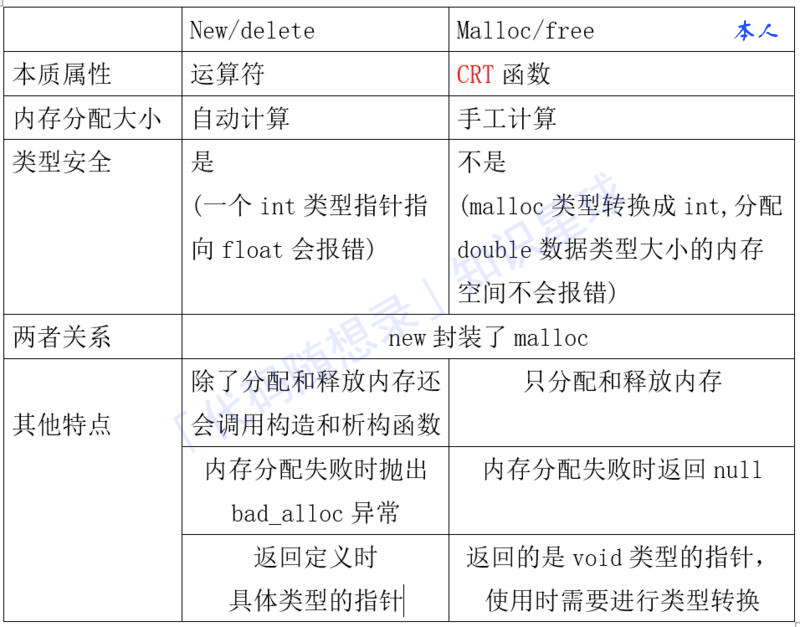

// 引用需要初始化且不能为空；指针可以延迟初始化，可以设为空指针
//指针可以重新指向；引用不能重新绑定

#include <iostream>
using namespace std;

int main() {
    // ====== 初始化对比 ======
    int a = 10;
    int* ptr;       // 指针可以延迟初始化
    ptr = &a;       // 现在指向a
    ptr = nullptr;  // 可以设为空指针

   int& ref = a;   // 引用必须初始化且不能为空
   // int& ref2;    // 错误：引用必须初始化
   // int& ref3 = nullptr; // 错误：不能绑定到空

   // ====== 重新绑定对比 ======
   int b = 20;
   ptr = &b;       // 指针可以重新指向b
   // &ref = b;     // 错误：引用不能重新绑定

   // ====== 内存占用对比 ======
   cout << "指针大小: " << sizeof(ptr) << " bytes" << endl; // 4或8字节
   cout << "引用大小: " << sizeof(ref) << " bytes" << endl;  // 显示a的大小

   // ====== 操作方式对比 ======
   *ptr = 30;      // 指针需要解引用
   ref = 40;       // 引用直接操作

    // ====== 安全性对比 ======
   if(ptr != nullptr) {  // 使用指针需要判空（行29）
       cout << *ptr << endl;
   }
   cout << ref << endl;  // 引用无需判空检查（行32）

   // ====== 动态内存管理 ======
   int* dynPtr = new int(50);  // 指针用于动态内存
   cout << *dynPtr << endl;
   delete dynPtr;              // 必须手动释放
   // 引用不能用于动态内存管理

   // ====== 函数参数传递 ======
   auto modifyByPtr =  { if(p) *p += 1; };
   auto modifyByRef =  { r += 1; };
   
   modifyByPtr(&a);
   modifyByRef(a);
   cout << "a = " << a << endl;  // 输出42

   //====== const的修饰 ======
   // 引用示例    
   const int ci = 10;  
   //int& r = ci;  // 错误：非const引用不能绑定到const对象
   const int& cr = ci;  //正确：const引用可以绑定到const对象
    //指针示例
   int a = 10;
   const int* p1 = &a;  // p1指向的值是const的
   //*p1 = 20;  //错误：不能通过p1修改a的值
   int* const p2 = &a;  // p2本身是const的，不能改变指向
   //p2 = &b;  //错误：不能改变p2指向的对象

   return 0;
}

什么时候用指针？ 遇到需要处理可能为NULL的情况（如可选参数时）遇到需要改变指向的对象（如遍历链表时）遇到需要动态内存分配（new/delete）遇到需要多级间接访问（如指针的指针）
什么时候用引用？ 函数参数传递，特别是大型对象时，可以避免拷贝开销，遇到必须绑定到有效对象的场景时（如类成员引用）实现链式调用（如返回*this引用）还有运算符的重载。

可以通过运算符 sizeof 判断数据类型的长度
cout << "int is " << sizeof (int) << " bytes. \n";
cout << "short is " << sizeof (short) << " bytes. \n";

头文件climits定义了符号常量：例如：INT_MAX 表示 int 的最大值，INT_MIN 表示 int 的最小值

静态变量在程序的整个生命周期内存在，并且只初始化一次。它们通常用于在函数调用之间保持变量的值。
生命周期：静态变量在程序启动时分配内存，并在程序结束时释放内存。
作用域：全局静态变量的作用域是整个程序，而局部静态变量的作用域是声明它的函数或代码块。
存储位置：静态变量通常存储在全局数据区，而不是栈上。
初始化：静态变量只能初始化一次，且默认初始化为0（对于基本数据类型）。

在类内部使用static关键字修饰的函数是静态函数。
静态函数属于类而不是类的实例，可以通过类名直接调用，而无需创建对象。
静态函数不能直接访问非静态成员变量或非静态成员函数。
class ExampleClass {
public:
    static void staticFunction() {
        cout << "Static function" << endl;
    }
};

在类中使用static关键字修饰的成员变量是静态成员变量。
所有类的对象共享同一个静态成员变量的副本。
静态成员变量必须在类外部单独定义，以便为其分配存储空间。
class ExampleClass {
public:
    static int staticVar;  // 静态成员变量声明
};

// 静态成员变量定义
int ExampleClass::staticVar = 0;

在类中使用static关键字修饰的成员函数是静态成员函数。
静态成员函数不能直接访问非静态成员变量或非静态成员函数。
静态成员函数可以通过类名调用，而不需要创建类的实例。
class ExampleClass {
public:
    static void staticMethod() {
        cout << "Static method" << endl;
    }
};

静态局部变量是定义在函数内部的静态变量。尽管它们在函数内部定义，但它们的行为与全局静态变量类似。
生命周期：静态局部变量在程序启动时分配内存，并在程序结束时释放内存，与全局静态变量相同。
作用域：静态局部变量的作用域仅限于定义它们的函数或代码块。
存储位置：与全局静态变量一样，静态局部变量也存储在全局数据区。
初始化：静态局部变量只能初始化一次，且默认初始化为0（对于基本数据类型）。
void exampleFunction() {
    static int localVar = 0;  // 静态局部变量
    localVar++;
    cout << "LocalVar: " << localVar << endl;
}

define 和 typedef 的区别
define
只是简单的字符串替换，没有类型检查
是在编译的预处理阶段起作用
可以用来防止头文件重复引用
不分配内存，给出的是立即数，有多少次使用就进行多少次替换
typedef
有对应的数据类型，是要进行判断的
是在编译、运行的时候起作用
在静态存储区中分配空间，在程序运行过程中内存中只有一个拷贝       

define 和 inline 的区别
1、define：
定义预编译时处理的宏，只是简单的字符串替换，无类型检查，不安全。
2、inline：
inline是先将内联函数编译完成生成了函数体直接插入被调用的地方，减少了压栈，跳转和返回的操作。没有普通函数调用时的额外开销；
内联函数是一种特殊的函数，会进行类型检查；
对编译器的一种请求，编译器有可能拒绝这种请求；
C++中inline编译限制：
不能存在任何形式的循环语句
不能存在过多的条件判断语句
函数体不能过于庞大
内联函数声明必须在调用语句之前

const和define的区别
const用于定义常量；而define用于定义宏，而宏也可以用于定义常量。都用于常量定义时，它们的区别有：
const生效于编译的阶段；define生效于预处理阶段。
const定义的常量，在C语言中是存储在内存中、需要额外的内存空间的；define定义的常量，运行时是直接的操作数，并不会存放在内存中。
const定义的常量是带类型的；define定义的常量不带类型。因此define定义的常量不利于类型检查。

new 和 malloc的区别
1、new内存分配失败时，会抛出bac_alloc异常，它不会返回NULL；malloc分配内存失败时返回NULL。
2、使用new操作符申请内存分配时无须指定内存块的大小，而malloc则需要显式地指出所需内存的尺寸。
3、opeartor new /operator delete可以被重载，而malloc/free并不允许重载。
4、new/delete会调用对象的构造函数/析构函数以完成对象的构造/析构。而malloc则不会
5、malloc与free是C++/C语言的标准库函数,new/delete是C++的运算符
6、new操作符从自由存储区上为对象动态分配内存空间，而malloc函数从堆上动态分配内存。

